<div align="center">

# MiniMind-Embedding & Rerank

</div>

<div align="center">

[](./LICENSE)
[](https://github.com/muzian666/minimind-embedding/commits/main)
[](https://github.com/muzian666/minimind-embedding/stargazers)
[](https://github.com/muzian666/minimind-embedding/pulls)
[](https://www.python.org/)
[](https://pytorch.org/)
[](https://github.com/embeddings-benchmark/mteb)

</div>

<div align="center">
  <h3>"向量化万物的最小起点"</h3>
</div>

<div align="center">

中文 | [English](./README_en.md)

</div>

* 本项目基于开源的 **[MiniMind](https://github.com/jingyaogong/minimind)** 小型语言模型（64M / 198M-A64M）作为底座，从零训练一套完整的 **文本 Embedding 与 Rerank 模型**，技术路线完全对齐 **[Qwen3-Embedding](https://arxiv.org/abs/2506.05176)**。
* 全套模型支持 **Dense 与 MoE 双版本**，并在相同数据/超参下完成**严格受控对比**——结论是反直觉的：**在小规模下，Dense(64M) 反而优于 MoE(198M)**（STS 0.478 vs 0.422），这印证了 Qwen3-Embedding 全系列选 Dense 架构的判断。最大序列长度 **8192**，覆盖 **中英文** 检索、STS、分类与重排任务。
* 所有核心算法（last-token pooling、InfoNCE 带假负样本 mask、MRL、pointwise yes/no rerank）均从 0 用 PyTorch 原生实现，不依赖第三方高层抽象。
* 训练全程可在 **单卡 RTX 5080（16GB）** 上完成（大规模弱监督阶段可选租 A100 加速），并提供 **Docker 一键环境**，本地与云端无缝迁移。
* 参加主流评测榜单 **C-MTEB / MTEB(eng)**，模型与结果均开源至 **HuggingFace Hub**。

> 注：本项目以 Apache 2.0 协议开源，完全免费。"单卡可跑" 指 Dense 版本在 RTX 5080 上完成全部三阶段训练的实测可行性，MoE 长序列训练建议使用更大显存。

---

<div align="center">

📌 **本项目是 MiniMind 生态的延伸，站在巨人的肩膀上。**

[](https://github.com/jingyaogong/minimind)
[](https://huggingface.co/Qwen/Qwen3-Embedding-0.6B)

</div>

---

# 📌 项目介绍

文本表示（Text Representation）是现代信息检索、RAG、语义搜索的基石。无论是检索增强生成（RAG）里的向量召回，还是搜索引擎里的相关性排序，都离不开两个核心模型：**把文本变成向量的 Embedding 模型**，和 **对候选文档精排的 Rerank 模型**。

近年来，以 BGE、GTE、E5、Qwen3-Embedding 为代表的表示学习模型取得了长足进步，Qwen3-Embedding 更是在 MTEB 多语言榜单登顶。然而，这些 SOTA 模型动辄 0.6B 起步，8B 版本更是需要大规模集群训练——对个人开发者和学习者而言，"打开黑盒子、理解每一行对比学习的损失函数是怎么写的"始终是一件奢侈的事。

这与 MiniMind 的作者 jingyaogong 当初做小型 LLM 时的初衷如出一辙：**"用乐高自己拼出一架飞机，远比坐在头等舱里飞行更让人兴奋"**。因此，本项目选择在 MiniMind 这个仅 64M 参数的小型语言模型底座之上，**完整复现 Qwen3-Embedding 的技术路线**——从 causal attention + last-token pooling 的架构选择，到带假负样本 mask 的 InfoNCE 损失，再到 Matryoshka 多维度表示与 pointwise yes/no 重排。我们不追求 SOTA 分数，而是追求 **可复现、可理解、可在单卡上跑通** 的完整工程闭环。

😊 一起感受把文本"压"进一个 768 维向量的乐趣吧！

---

#### 🎉 本项目包含以下内容

- 提供完整的 **Embedding 与 Rerank 模型结构代码**（Dense + MoE），底座复用 MiniMind-3，head 层面向表示学习重新设计。
- 提供 **last-token pooling** 的正确实现（兼容左/右 padding，对齐 Qwen3-Embedding 官方）。
- 提供 **InfoNCE 带假负样本 mask** 的损失函数逐字实现（含 Qwen3 报告里的 `m_ij` mask 公式）。
- 提供 **Matryoshka Representation Learning (MRL)** 多维度输出训练（768/512/256/128/64）。
- 提供 **pointwise yes/no Rerank** 实现（复用 lm_head，把相关性判断建模为下一个 token 预测）。
- 覆盖 **三阶段训练流程**：弱监督预训练 → 监督微调 → SLERP 模型融合。
- 兼容 `sentence-transformers`、`transformers` 主流框架，提供 `mteb` 评测脚本，可上传 HuggingFace Hub。
- 提供 **Docker 一键环境**（CUDA 13.3 + cuDNN + torch cu130），原生支持 RTX 5080（Blackwell sm_120）。
- 支持最大 **8192** 长上下文（底座原生支持 32768，无需任何 RoPE 外推）。

---

#### 🎉 已发布模型列表

> ✅ Dense 与 MoE 两个版本均完成三阶段。Dense STS 0.48 优于 MoE 0.42(详见对比)。

| 模型 | 类型 | 参数量 | 底座 | 最大长度 | 状态 | STS 平均 |
|------|------|--------|------|----------|------|:---:|
| minimind-embedding-dense | Embedding | 64M | minimind-3 | 8192 | ✅ 三阶段完成 | **0.478** |
| minimind-embedding-moe | Embedding | 198M-A64M | minimind-3-moe | 8192 | ✅ 三阶段完成 | 0.422 |
| minimind-rerank-dense | Rerank | 64M | minimind-3 | 8192 | ✅ v0 零样本(MAP@10 0.47) | — |
| minimind-rerank-moe | Rerank | 198M-A64M | minimind-3-moe | 8192 | 🚧 待训练 | — |

---

#### 📝 更新日志

<details>
<summary><b>🔥 2026-07-29</b></summary>

 - **MoE 版本完整三阶段完成**(严格受控对比 Dense):
   - Stage1 弱监督:2827 步,loss 1.18→0.45
   - Stage2 监督:t2ranking-15,63768 步 / 3 epoch,loss 1.55→0.85(高于 Dense 的 0.72)
   - Stage3 SLERP 融合:最后5个 checkpoint 球面线性插值
   - **反直觉发现:MoE(198M) STS 0.422 < Dense(64M) STS 0.478**,训练侧 loss 更高与评测侧 STS 更低相互印证
   - 三大原因:MoE fragmentation(专家割裂损害全局语义聚合)、激活参数与 Dense 持平(总参翻 3 倍但有效容量没涨)、routing overhead(路由在有限数据下未学好);印证 Qwen3-Embedding 选 dense 的设计
 - Dense Embedding 已发布 HuggingFace: [Muzian/minimind-embedding-dense](https://huggingface.co/Muzian/minimind-embedding-dense)
 - Dense Rerank v0:纯预训练底座零样本 MAP@10=0.47(最佳),pointwise 微调反降(灾难性遗忘)

</details>

<details>
<summary><b>🔥 2026-07-28 (晚)</b></summary>

 - **Embedding 完整三阶段完成**(云端 RTX 5090):
   - Stage1 弱监督:t2ranking triplet 9万条,batch=64,1413步,loss 1.16→0.43
   - Stage2 监督:t2ranking-15 34万条,batch=16,**num_workers=128**,3 epoch,63768步,loss 1.47→0.72
   - Stage3 SLERP 融合:最后5个 checkpoint 球面线性插值
 - STS 评测:Stage2(0.478) vs Stage3(0.478),融合在小模型上收益不明显
 - **关键性能优化**:num_workers=128(208核CPU)将 GPU 利用率从 18~99% 波动提升到 92~96% 稳定满载
 - **瓶颈定位**:分数受限于 minimind 底座 vocab=6400 + Stage1 数据量不足(9万 vs Qwen3 的1.5亿)
 - **Rerank 重要发现**:纯预训练底座零样本 MAP@10=0.47(最佳),pointwise 微调反降至0.24(灾难性遗忘)

</details>

<details>
<summary><b>🔥 2026-07-28 (早)</b></summary>

 - **M2 完成**：Dense Embedding Stage 2 全量训练（t2ranking-15，34万条，42513 步，~4.5h）。
 - loss 从 1.9 平滑收敛至 0.95，全程无发散/塌缩。wandb 完整记录。
 - STS 评测（ATEC/BQ/LCQMC/STSB）：**平均 Spearman 0.49**，较 mini 基线（0.29）提升 69%。STSB 单项达 0.67，接近 BGE-small-zh 水平。
 - 新增 M3 Rerank 代码（pointwise yes/no，对齐 Qwen3-Reranker）。

</details>

<details>
<summary><b>🔥 2026-07-27</b></summary>

 - 项目启动：完成整体架构设计与 M1 里程碑（共享底座 + Dense Embedding 训练链路跑通）。
 - 实现 `shared/` 共享层：MiniMindForEmbedding / MiniMindForRerank 模型类、last-token pooling、InfoNCE 带假负样本 mask、MRL 损失、配置预设、tokenizer 适配（复用现成的 `是`/`否` token）。
 - 实现 `minimind_embedding/` 训练模块：三阶段训练脚本（stage1 弱监督 / stage2 监督+MRL）、本地 jsonl 与 HuggingFace datasets 双数据源、demo smoke test 数据。
 - 搭建 Docker 环境（CUDA 13.3 + torch 2.13 cu130 + mteb 2.18 + sentence-transformers 5.6），在 RTX 5080 上验证 smoke test：loss 从 1.53 正常下降至 0。

</details>

---

# 📌 快速开始

<details>
<summary><b>本人的软硬件配置（供参考）</b></summary>

| 项目 | 配置 |
|------|------|
| 操作系统 | Windows 11 (win32 10.0.26200) |
| GPU | NVIDIA GeForce RTX 5080（16GB，Blackwell sm_120） |
| GPU 驱动 | 610.43.02（CUDA 13.3 UMD） |
| 容器 | Docker Desktop + WSL2 后端 + NVIDIA Container Toolkit |
| 训练环境 | Docker: `nvidia/cuda:13.3.0-cudnn-devel-ubuntu24.04` + torch 2.13.0+cu130 |

> ⚠️ RTX 5080 是 Blackwell 架构（计算能力 sm_120），**必须使用 CUDA 12.8+ 与 PyTorch cu128+ wheel**。本项目统一使用 CUDA 13.3 + torch cu130，详见 Docker 章节。其他 GPU（如 3090/4090/A100）也兼容此环境。

</details>

## 第0步 克隆与准备环境

本项目依赖 [MiniMind](https://github.com/jingyaogong/minimind) 作为底座，需要先把它 clone 到本仓库的 `minimind/` 目录下（本仓库不包含 minimind 源码，避免重复维护）：

```bash
git clone https://github.com/muzian666/minimind-embedding.git
cd minimind-embedding

# 拉取 MiniMind 底座到 ./minimind(代码通过相对路径 import 它)
git clone https://github.com/jingyaogong/minimind.git minimind
```

本项目**强烈推荐使用 Docker**（尤其 Windows 用户），可避免 CUDA/cuDNN/torch 版本地狱。如果你坚持本地环境，参考 `requirements.txt` 自行安装（注意 Blackwell GPU 必须用 cu130 wheel）。

### 方式 A：Docker 一键环境（推荐）

```bash
# 构建（首次约 5-10 分钟，下载 torch cu130）
docker compose -f docker/docker-compose.yml build

# 验证 GPU 可见
docker compose -f docker/docker-compose.yml run --rm dev nvidia-smi

# 进入交互式开发环境
docker compose -f docker/docker-compose.yml run --rm dev
```

### 方式 B：本地环境

```bash
# 必须用 cu130 索引（Blackwell 支持）
pip install torch --index-url https://download.pytorch.org/whl/cu130
pip install -r requirements.txt
```

## Ⅰ 🚀 模型推理

> ⏳ 模型训练完成后，本章节将补充完整的推理示例。当前可参考下方训练章节先跑通流程。

### 1' 下载模型

模型发布后将上传至 HuggingFace：

```bash
# 训练完成后补充
# huggingface-cli download andyl/minimind-embedding-dense
```

### 2' 调用 Embedding（last-token pooling）

```python
# 训练完成后补充完整示例。核心逻辑（对齐 Qwen3-Embedding）：
#
# from shared import load_tokenizer, MiniMindForEmbedding
# tokenizer = load_tokenizer(padding_side="left")
# model = MiniMindForEmbedding.from_pretrained("andyl/minimind-embedding-dense")
#
# enc = build_embedding_inputs(tokenizer, ["你的查询文本"], is_query=True)
# embedding = model.encode(enc["input_ids"], enc["attention_mask"])  # [1, 768] 已 L2 归一化
```

## Ⅱ 🛠️ 模型训练

### 1' 下载数据

训练数据来自社区开源数据集（详见 [数据介绍](#-数据介绍) 章节）。HuggingFace 数据源由脚本自动下载，也可手动准备本地 jsonl。

### 2' 开始训练

#### 2.1 Smoke Test（验证环境，约 1 分钟）

```bash
# 使用内置 demo 数据，验证训练链路能跑通、loss 能下降
docker compose -f docker/docker-compose.yml run --rm smoke
```

预期输出：`loss 1.53 → 0.69 → 0.087 → 0`（在 16 类 demo 数据上快速收敛，证明前向/反向/损失计算全部正确）。

#### 2.2 Embedding 正式训练（三阶段）

<details>
<summary><b>💡 三阶段训练流程说明</b></summary>

对齐 Qwen3-Embedding 报告的三个阶段：

| 阶段 | 数据 | 损失 | 目的 |
|------|------|------|------|
| **Stage 1 弱监督预训练** | 大规模 BM25/triplet 数据（T2Ranking, mMARCO） | 标准 InfoNCE（纯 in-batch） | 通用的语义对齐能力 |
| **Stage 2 监督微调** | 高质量标注 + hard negatives | InfoNCE + 假负样本 mask + MRL | 精细化任务表现 |
| **Stage 3 模型融合** | Stage 2 的最后 N 个 checkpoint | SLERP 球面线性插值 | 提升鲁棒性 |

</details>

```bash
# Stage 1:弱监督预训练（大 batch，纯 in-batch InfoNCE）
docker compose -f docker/docker-compose.yml run --rm dev python -m minimind_embedding.train \
    --config embed_dense_64m --stage 1 \
    --data_type hf --hf_dataset t2ranking \
    --from_weight pretrain \
    --batch_size 128 --epochs 1 --max_length 512 \
    --lr 2e-4 --device cuda

# Stage 2:监督微调（带 hard neg + 假负样本 mask + MRL）
docker compose -f docker/docker-compose.yml run --rm dev python -m minimind_embedding.train \
    --config embed_dense_64m --stage 2 --use_mrl \
    --data_type hf --hf_dataset t2ranking \
    --from_weight embedding_stage1 \
    --batch_size 64 --epochs 1 --max_length 512 \
    --lr 1e-5 --device cuda

# Stage 3:模型融合（见 scripts/merge_models.py,训练完成后补充）
```

> 训练后的模型权重默认保存为：`checkpoints/embedding/embedding_stage{1,2}_{dim}{_moe}.pth`（MoE 版本带 `_moe` 后缀）

---

# 📌 数据介绍

## Ⅰ Tokenizer

本项目**直接复用 MiniMind 的 BPE tokenizer**（vocab=6400，中英文混合，ByteLevel），**不扩展词表**。详见 [MiniMind Tokenizer 说明](https://github.com/jingyaogong/minimind)。

Rerank 模型复用词表中现成的中文 token：

| Token | ID | 用途 |
|-------|----|----|
| `是` | 357 | Rerank 正样本目标 token（相关） |
| `否` | 1332 | Rerank 负样本目标 token（不相关） |

> 💡 **为什么用现成的"是"/"否"而非新增 `<yes>`/`<no>`**：新增 token 的 embedding 是随机初始化的，预训练从未见过，64M 小模型难以学好"相关性 → 新 token"的映射（实测会学反）。"是"/"否"是单 token、语义明确、预训练见过无数次，直接复用最稳。

## Ⅱ Embedding 训练数据格式

统一的 jsonl 三元组格式：

```jsonl
{"query": "天空为什么是蓝色的", "positive": "太阳光穿过大气层时，蓝光波长较短被散射，所以天空呈蓝色。", "hard_negatives": ["水在0度以下会结成冰。", "光合作用是植物利用阳光合成有机物的过程。"]}
{"query": "水的沸点", "positive": "在标准大气压下，纯水加热到100摄氏度时会沸腾。", "hard_negatives": ["地球围绕太阳公转一周约需365天。"]}
```

## Ⅲ Rerank 训练数据格式

```jsonl
{"query": "天空为什么是蓝色的", "document": "太阳光穿过大气层时，蓝光波长较短被散射，所以天空呈蓝色。", "label": 1}
{"query": "天空为什么是蓝色的", "document": "水在0度以下会结成冰。", "label": 0}
```

## Ⅳ 数据集来源

> ⏳ 完整数据集清单与预处理脚本将在 M2 里程碑补充。计划使用的数据集：

| 数据集 | 语言 | 用途 | HF 仓库 | License |
|--------|------|------|---------|---------|
| T2Ranking | 中文 | Embedding/Rerank 训练 | [`THUIR/T2Ranking`](https://huggingface.co/datasets/THUIR/T2Ranking) | Apache-2.0 |
| mMARCO | 中英 | Embedding/Rerank 训练 | [`unicamp-dl/mmarco`](https://huggingface.co/datasets/unicamp-dl/mmarco) | Apache-2.0 |
| C-MTEB 系列 | 中文 | Rerank 训练+评测 | [`C-MTEB/T2Reranking`](https://huggingface.co/datasets/C-MTEB/T2Reranking) 等 | - |
| msmarco | 英文 | Rerank 训练 | [`sentence-transformers/msmarco`](https://huggingface.co/datasets/sentence-transformers/msmarco) | - |
| NLI-zh | 中文 | STS 训练 | [`shibing624/nli-zh-all`](https://huggingface.co/datasets/shibing624/nli-zh-all) | - |

---

# 📌 模型

## 结构

本项目在 MiniMind 的 decoder-only causal Transformer 之上，分叉出两个面向表示学习的 head：

```
                    ┌─────────────────────────────────────────┐
                    │   MiniMind 底座(共享,只读复用)            │
                    │                                         │
   input_ids ──────►│  embed → [Block×8] → norm → hidden      │
   + EOS            │   (causal attn + GQA + SwiGLU + QKNorm) │
                    │   (可选 MoE:4 expert top-1)              │
                    └────────────────┬────────────────────────┘
                                     │ last_hidden_state
                                     ▼
                          ┌──────────┴──────────┐
                          │ last_token_pool     │  ← 取最后非 pad token(EOS 位置)
                          └──────────┬──────────┘
                                     │
                    ┌────────────────┴────────────────┐
                    │                                 │
              Embedding 分支                    Rerank 分支
                    │                                 │
            Linear(768→768)                   复用 lm_head
            + LayerNorm                       (无新增参数)
            + L2 normalize                          │
                    │                          取 yes/no logits
                    │                          softmax → score
                    ▼
            句向量 [768]
        (支持 MRL 切片到 512/256/128/64)
```

## 模型配置

| Model Name | params | len_vocab | max_pos | rope_theta | n_layers | d_model | kv_heads | q_heads | note |
|------------|--------|-----------|---------|------------|----------|---------|----------|---------|------|
| minimind-embedding-dense | 64M | 6400 | 32768 | 1e6 | 8 | 768 | 4 | 8 | Dense + last-token pool + MRL |
| minimind-embedding-moe | 198M-A64M | 6400 | 32768 | 1e6 | 8 | 768 | 4 | 8 | 4 experts / top-1 |
| minimind-rerank-dense | 64M | 6400 | 32768 | 1e6 | 8 | 768 | 4 | 8 | Dense + pointwise yes/no |
| minimind-rerank-moe | 198M-A64M | 6400 | 32768 | 1e6 | 8 | 768 | 4 | 8 | 4 experts / top-1 |

> 所有模型的 `max_position_embeddings=32768`（底座原生支持），本项目训练时使用 `max_length=8192`，无需任何 RoPE 外推。如需扩展到 32768，可启用底座内置的 YaRN 外推（factor=16）。

## Last-token Pooling 原理

> 🧒 **一句话理解**：句子就像一队人排队，最后一个人（EOS）通过"传话游戏"听到了前面所有人说的话，所以他一个人就能代表整句话的意思。

<div align="center">

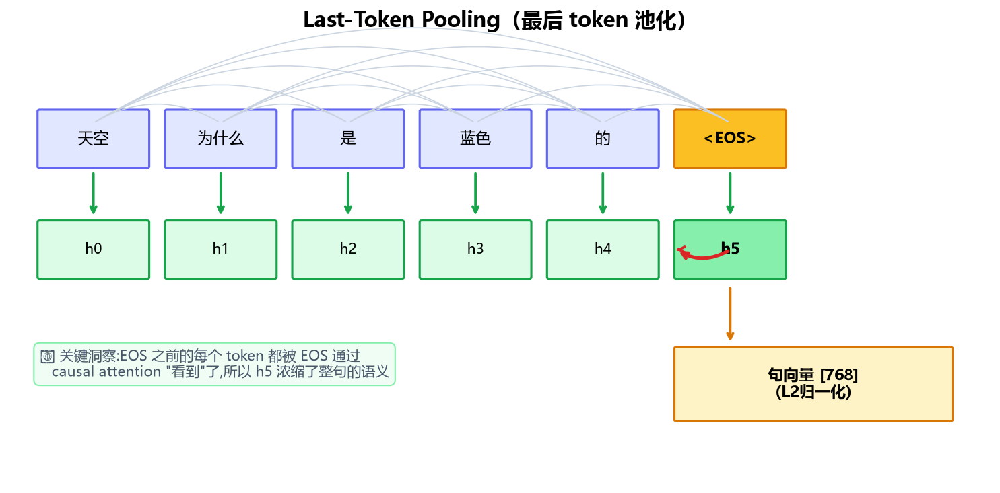

</div>

为什么 causal（单向）语言模型也能做 embedding？这是 Qwen3-Embedding 给出的关键洞察：

传统的 BERT 风格 encoder 用**双向注意力 + mean/CLS pool**（每个人都能看到所有人，取平均），而 Qwen3-Embedding 反其道而行，**保留 causal（单向）注意力，只取最后一个 token（EOS）的 hidden state 作为整句向量**。原因在于：

1. **权重复用最大化**：causal LM 的预训练分布与生成模型完全一致，可直接加载预训练权重，无需重新预热。双向 attention 会破坏预训练学到的位置先验。
2. **最后一个 token "看过"整个序列**：在 causal attention 下（单向，只能看前面），位置 `T` 的 token 通过注意力机制聚合了前 `T-1` 个 token 的全部信息，就像排队末尾的人通过传话听到了前面所有人的话——他一个人就浓缩了整句的语义，天然适合作为摘要表示。
3. **末尾追加 EOS 作为锚点**：让模型在序列末尾看到一个明确的"结束"信号，使最后一个 token 的表示更加稳定。

本项目的 `shared/utils.py:last_token_pool` 严格对齐 Qwen3-Embedding-0.6B 官方实现，正确处理左/右 padding：

```python
def last_token_pool(last_hidden_states, attention_mask):
    left_padding = attention_mask[:, -1].sum() == attention_mask.shape[0]
    if left_padding:
        return last_hidden_states[:, -1]              # 左 padding:末列即最后真实 token
    sequence_lengths = attention_mask.sum(dim=1) - 1   # 右 padding:按 mask 长度定位
    return last_hidden_states[torch.arange(batch_size), sequence_lengths]
```

> ⚠️ **padding side 陷阱**：本项目统一使用**左 padding**（`tokenizer.padding_side="left"`），此时 `[:, -1]` 直接就是最后真实 token，O(1) 取值且不会取到 pad。若混用右 padding 又直接取 `[:, -1]`，会拿到 pad token 的表示（错误）。

## MRL 多维度输出原理

> 🧒 **一句话理解**：就像俄罗斯套娃——大套娃里装着小套娃，每个尺寸都能用。训练出的向量也一样：768 维是"大套娃"（最准），截断到 64 维是"小套娃"（最快），每个尺寸都保持语义。

<div align="center">

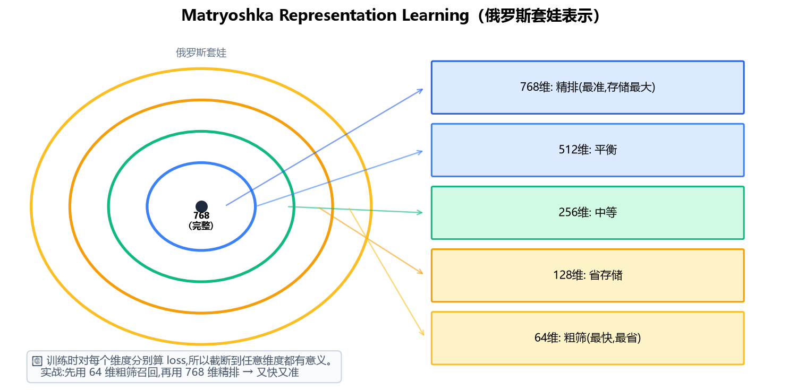

</div>

Matryoshka Representation Learning（Kusupati et al., 2022，俄罗斯套娃表示学习）让一个向量在不同维度截断下都保持良好语义：

```
完整向量 [768] ──┬── 取前 512 维 → 可用于 512 维索引
                ├── 取前 256 维 → 可用于 256 维索引
                ├── 取前 128 维 → 可用于 128 维索引
                └── 取前  64 维 → 可用于  64 维索引(最省存储)
```

**实战场景**：检索系统先用 64 维向量粗筛（快，从百万文档里召回几百条），再用 768 维精排（准，从几百条里选最相关的）——又快又准。

训练时对每个维度切片**分别计算 InfoNCE 损失**，再求平均：

```math
\mathcal{L}_{MRL} = \frac{1}{|D|}\sum_{d \in D} \mathcal{L}_{InfoNCE}(z_{[:d]})
```

其中 `D = {768, 512, 256, 128, 64}`。这样训练出的向量，截断到任意维度都可直接用于 ANN 检索，存储与计算成本灵活可调。

---

# 📌 实验

> ✅ Dense 与 MoE 两个版本均已完成**完整三阶段**(Stage1 弱监督 → Stage2 监督+MRL → Stage3 SLERP 融合)。

## Ⅰ 训练开销

实测环境:
- **Stage1/2/3**:云端 RTX 5090 (32GB,Blackwell sm_120) + torch 2.8 cu128,208 核 CPU(`num_workers=128` 充分发挥)
- **早期验证**:本地 RTX 5080 (16GB) + Docker (CUDA 13.3 + torch 2.13 cu130)

| 版本 | 阶段 | 数据 | 配置 | 步数 | 耗时 | Loss |
|------|------|------|------|------|------|------|
| **Dense** | Stage 1 | t2ranking triplet 9万条 | batch=64, lr=2e-4 | 1413 | ~10min | 1.16→0.43 |
| **Dense** | Stage 2 | t2ranking-15 34万条 | batch=16, workers=128, 3epoch, MRL | 63768 | ~6.8h | 1.47→0.72 |
| **Dense** | Stage 3 | Stage2 最后5 ckpt | SLERP t=0.5 | — | <1min | — |
| **MoE** | Stage 1 | 同上 | 同上 | 2827 | ~10min | 1.18→0.45 |
| **MoE** | Stage 2 | 同上 | 同上(严格受控对比) | 63768 | ~6.8h | 1.55→0.85 |
| **MoE** | Stage 3 | 同上 | SLERP t=0.5 | — | <1min | — |

> 性能关键点:`num_workers=128`(208核 CPU)将 GPU 利用率从 18~99% 波动提升到 **92~96% 稳定满载**,数据加载彻底不是瓶颈。
> MoE 显存占用 31.4GB/32GB(接近满载),Dense 25.4GB。两者训练耗时相近。
> **MoE 的收敛 loss(~0.85)整体高于 Dense(~0.72)**,说明在相同数据/超参下 MoE 优化得更"吃力"——这是它在 STS 上反而落后的训练侧表征(详见评估章节 Dense vs MoE 对比)。

### 关于 Stage 1 数据量的反思

当前 Stage 1 仅用 9 万条数据(1 epoch),而 **Qwen3-Embedding 报告的 Stage 1 是 1.5 亿对**(我们的 ~1660 倍)。Stage 1 的目的是"大规模弱监督建立语义对齐基础",数据量差三个数量级,语义对齐没学透,这是当前 STS 分数受限的主要原因之一。后续改进方向:扩充 Stage 1 数据(合成 query、多源召回)。

## Ⅱ Loss 收敛曲线(Stage 2,Dense,3 epoch)

| step | epoch | loss | 说明 |
|------|-------|------|------|
| 1000 | 0 | 1.47 | 初始 |
| 16000 | 0 | 1.29 | 第1轮中期 |
| 32000 | 1 | 1.03 | 第2轮 |
| 48000 | 2 | 0.72 | 第3轮 |
| 63768 | 2(终) | 0.72 | 收敛 |

<div align="center">

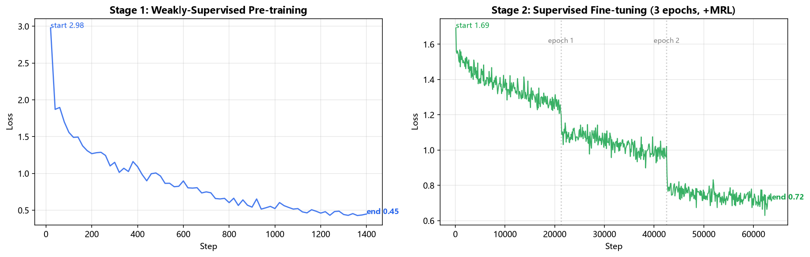

</div>

<div align="center">

**Dense 训练 Loss 曲线（Stage1 + Stage2）**

</div>

MoE 版本在同一份数据与超参下也完成了完整三阶段，其训练曲线单独展示如下：

<div align="center">

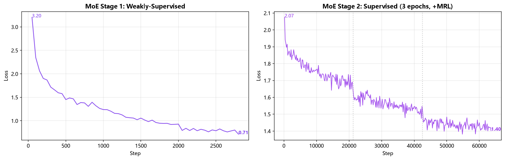

</div>

<div align="center">

**MoE 训练 Loss 曲线（Stage1 + Stage2）**

</div>

把两条曲线叠在一起更直观——可以看到 MoE 的 loss 始终高于 Dense,差距约 0.13:

<div align="center">

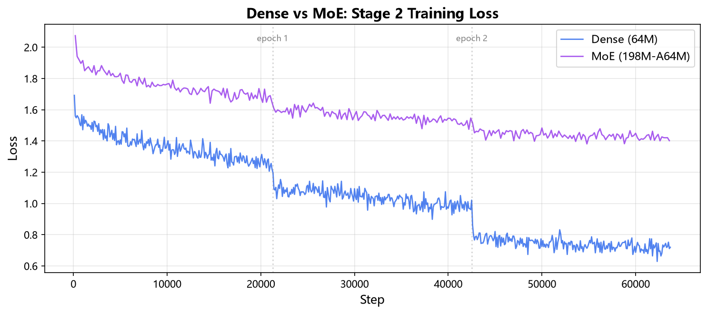

</div>

> **注意**:MoE 的 Stage 2 loss(~0.85)高于 Dense(~0.72)。MoE 的 top-1 routing 使每个 token 只激活 1/4 expert,等效计算量更少,优化更"吃力"。更关键的是,**训练侧 loss 更高与评测侧 STS 更低（0.422 < 0.478）相互印证**,说明 MoE 在小规模下确实不如 Dense。真实表现需看 STS 评测(见评估章节 Dense vs MoE 对比)。

## Ⅱ Embedding 训练（三阶段）

### 1' 弱监督预训练（Stage 1）✅ 已完成

**理念**：让模型先学会"什么样的文本对是语义相关的"。这一阶段使用大规模（弱标注）数据，依赖大 batch 提供足够的负样本信号，使用**标准 InfoNCE**（不带假负样本 mask——因为弱监督数据噪声大，mask 反而会误伤真负样本）。

#### InfoNCE 是什么？（人话版）

> 🧒 **类比**：想象你在玩"找朋友"游戏。给你一张照片（query），要从一堆照片里找出你的好朋友（正样本），其他人（负样本）都不是你的朋友。InfoNCE 就是训练你的"眼力"——让正确朋友的得分尽量高，陌生人的得分尽量低。

<div align="center">

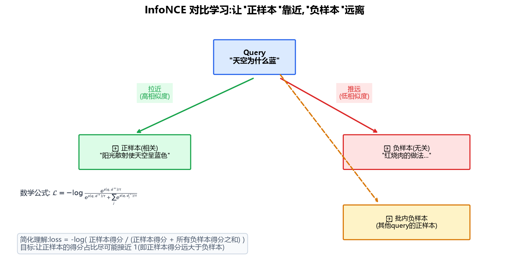

</div>

**简化理解**：

$$\text{loss} = -\log \frac{\text{正样本得分}}{\text{正样本得分} + \text{所有负样本得分之和}}$$

- 如果模型把正样本排在第一位（得分远高于负样本），loss 接近 0（"找朋友"很准）
- 如果模型把正样本和负样本混在一起，loss 很大（还需要练）

**严格公式**（标准 InfoNCE）：

```math
\mathcal{L}_{InfoNCE} = -\frac{1}{N}\sum_{i=1}^{N} \log \frac{\exp(s(q_i, d_i^+)/\tau)}{\exp(s(q_i, d_i^+)/\tau) + \sum_{j \neq i} \exp(s(q_i, d_j)/\tau)}
```

其中 `s(·,·)` 为 cosine 相似度，`τ=0.02` 为温度（让得分差异更尖锐：好朋友的得分要"明显"高于陌生人）。

> 💡 **温度 τ 的作用**：τ 越小，模型越"严格"——正样本必须比负样本高很多才算过关；τ 越大，越"宽容"。0.02 是经验值，让模型学得又快又稳。

Stage 1 训练命令(本项目已完成,产出 `embedding_stage1_768.pth`):

```bash
docker compose -f docker/docker-compose.yml run --rm dev python -m minimind_embedding.train \
    --config embed_dense_64m --stage 1 \
    --data_type hf --hf_dataset t2ranking \
    --from_weight pretrain --backbone_dir /workspace/out \
    --batch_size 128 --epochs 1 --max_length 512 --lr 2e-4 --device cuda
```

### 2' 监督微调（Stage 2）✅ 已完成

**理念**：在高质量标注数据上精细调整，引入 hard negatives（困难负样本）和**假负样本 mask**。

#### 为什么要"假负样本 mask"？（人话版）

> 🧒 **问题**：训练时我们会把"不相关"的文本当负样本，让模型远离它。但万一这个"负样本"其实和 query 是相关的呢？比如 query 问"感冒怎么治"，负样本里混进了一条"感冒需要对症治疗，注意休息"——它明明也相关，却被当成反面教材。模型如果拼命远离它，反而学坏了！

<div align="center">

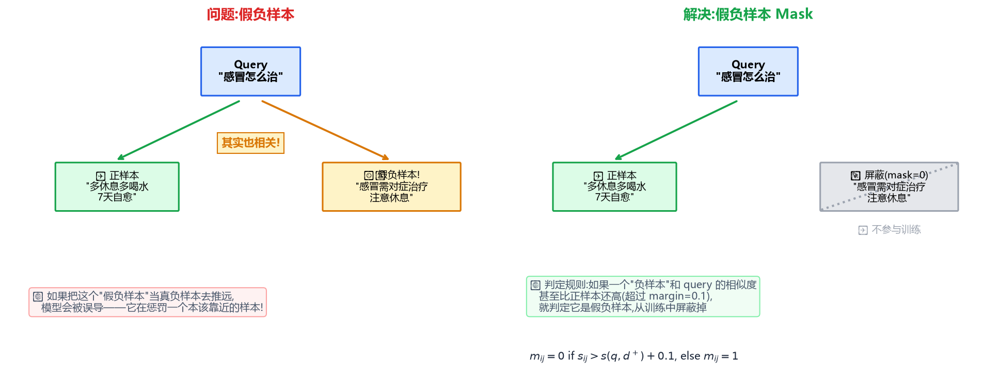

</div>

**Qwen3 的解决方案**：训练前先检查每个负样本——如果它和 query 的相似度**甚至比正样本还高**（超过 margin=0.1），就判定为"假负样本"，用 mask 把它屏蔽掉（不参与训练）。

**mask 判定规则**：

$$m_{ij} = \begin{cases} 0 & \text{if } s_{ij} > s(q_i, d_i^+) + 0.1 \quad \text{(假负样本,屏蔽)} \\ 1 & \text{otherwise} \quad \text{(真负样本,正常训练)} \end{cases}$$

**带 mask 的 InfoNCE 完整损失**（Qwen3-Embedding 报告公式逐字实现）：

$$\mathcal{L} = -\frac{1}{N}\sum_{i} \log \frac{e^{s(q_i,d_i^+)/\tau}}{Z_i}$$

$$Z_i = e^{s(q_i,d_i^+)/\tau} + \underbrace{\sum_k m_{ik} e^{s(q_i,d_{i,k}^-)/\tau}}_{\text{hard negatives}} + \underbrace{\sum_{j\neq i} m_{ij} e^{s(q_i,q_j)/\tau}}_{\text{批内 query-query}} + \underbrace{\sum_{j\neq i} m_{ij} e^{s(d_i^+,d_j)/\tau}}_{\text{批内 doc-doc}}$$

> 💡 **直觉**：分母 `Z_i` 聚合了正样本 + 所有负样本（hard neg + 批内 neg），但每个负样本都乘了 mask `m_ij`——假负样本的 mask=0，自动从分母里消失，不会被错误地推远。

实际训练命令（本项目实测）:

```bash
# Dense 版(云端 RTX 5090,基于 Stage1 产出)
nohup python -u -m minimind_embedding.train \
    --config embed_dense_64m --stage 2 --use_mrl \
    --data_type hf --hf_dataset t2ranking-15 \
    --from_weight embedding_stage1 --backbone_dir checkpoints/embedding \
    --batch_size 16 --epochs 3 --max_length 256 --num_workers 128 \
    --max_negatives 7 --temp 0.02 --margin 0.1 --lr 1e-5 \
    --log_steps 200 --save_steps 4000 \
    --wandb_project minimind-embedding --wandb_run_name stage2 \
    --device cuda > stage2.log 2>&1 &
```

> 训练后的模型权重保存为:`checkpoints/embedding/embedding_stage2_768.pth`（124 MB）。
> MoE 版只需把 `--config embed_dense_64m` 改为 `--config embed_moe_198m`。

**Loss 收敛曲线**（t2ranking-15 全量 34 万条，3 epoch，63768 步）:

| step | 1000 | 16000 | 32000 | 48000 | 63768(终) |
|------|------|-------|-------|-------|-----------|
| Dense loss | 1.47 | 1.29 | 1.03 | 0.72 | **0.72** |
| MoE loss | 1.55 | 1.32 | 1.05 | 0.90 | **0.85** |

<div align="center">

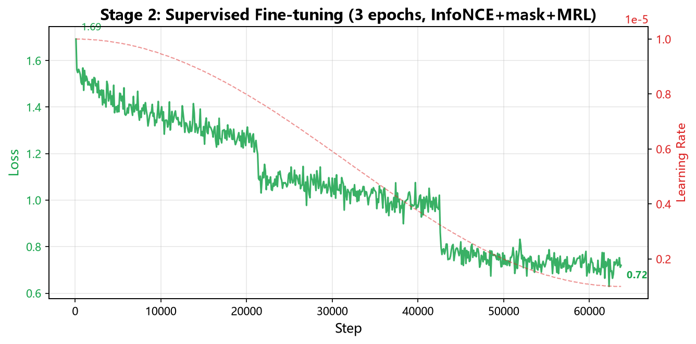

</div>

### 3' 模型融合（Stage 3）✅ 已完成

> 🧒 **一句话理解**：Stage2 训练过程中存了好几个"快照"（checkpoint），每个快照各有所长。Stage3 就是把它们"揉"在一起，取长补短，得到一个更稳的最终模型——就像把几个同学的不同答案综合起来，比任何一个人的都靠谱。

**理念**：对 Stage 2 训练过程中保存的最后 N 个 checkpoint 做**球面线性插值（SLERP）**，融合多个模型的互补能力，提升鲁棒性。

SLERP 的核心思想：对两个模型在同一位置的参数向量，在它们构成的"球面"上做插值。当两个向量方向接近时，退化为加权平均；方向差异大时，沿大圆弧旋转插值，保留两者的方向特征。

**实际命令**（取 Stage2 最后 5 个 checkpoint 融合）：

```bash
python scripts/merge_models.py \
    --glob "checkpoints/embedding/embedding_stage2_768_step*.pth" \
    --last_n 5 \
    --output checkpoints/embedding/embedding_stage3_768.pth \
    --t 0.5
```

> **本项目实测结论**：Stage3 融合后 STS 分数（0.4778）与 Stage2 未融合（0.4777）几乎一致。在小模型（64M）上，训练后期的 checkpoint 本身已经很接近，融合的边际收益不明显；Qwen3-Embedding 的融合收益来自大模型（0.6B+）的更高维度表达空间。

## Ⅲ Rerank 训练

### 1' Pointwise yes/no 微调

**理念**（Qwen3-Reranker 同款）：把"判断 query-doc 是否相关"建模成下一个 token 预测——让模型在 `[Query]\n[Document]` 之后输出 `是` 或 `否`。复用预训练的 lm_head，**不引入任何新参数**。

Prompt 模板：

```
<|im_start|>system
Judge whether the Document meets the requirements based on the Query. Only output "yes" or "no".<|im_end|>
<|im_start|>user
<Query>: {query}
<Document>: {document}<|im_end|>
<|im_start|>assistant
```

损失（pointwise 交叉熵）：

```math
\mathcal{L}_{rerank} = -\frac{1}{N}\sum_{i} \left[ y_i \log p(\text{yes}) + (1-y_i) \log p(\text{no}) \right]
```

> ⏳ 训练命令与 loss 曲线待 M3 补充。

---

# 📌 评估

> ✅ Dense 版本完整三阶段已完成 STS 评测。完整 C-MTEB 35 任务榜单正在准备中（mteb v2 集成中）。

## Ⅰ STS 结果（中文，Spearman 相关系数）

评测方法：[C-MTEB](https://github.com/embeddings-benchmark/mteb) 标准 STS 任务 test split，模型编码 sentence1/sentence2（last-token pooling + L2 归一化），计算 cosine 相似度与人工标注的 Spearman 相关。

| 任务 | 样本数 | **Dense(Stage3)** | **MoE(Stage3)** | 差值 | mini基线 |
|------|--------|:---:|:---:|:---:|:---:|
| ATEC | 20000 | **0.265** | 0.201 | -0.064 | 0.13 |
| BQ | 10000 | **0.379** | 0.297 | -0.082 | 0.25 |
| LCQMC | 12500 | **0.631** | 0.582 | -0.049 | 0.50 |
| STSB | 1361 | **0.637** | 0.607 | -0.030 | — |
| **平均** | | **0.478** | 0.422 | **-0.056** | 0.29 |

<div align="center">

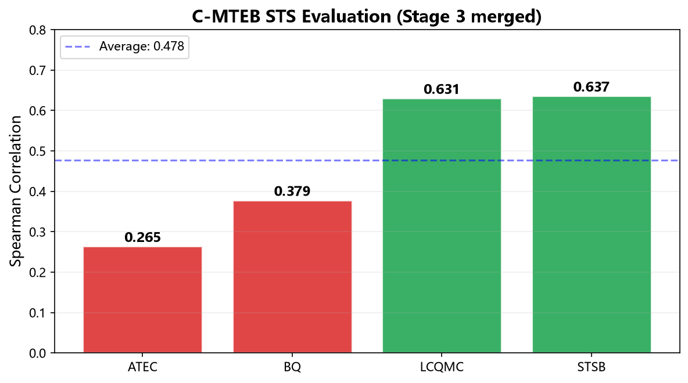

</div>

### Dense vs MoE 对比（严格受控）

两版本在**完全相同的数据、超参、流程**下训练（唯一区别是 backbone 架构），因此差异完全来自 Dense vs MoE 架构本身:

| 任务 | 样本数 | **Dense(64M)** | **MoE(198M-A64M)** | 差值 |
|------|--------|:---:|:---:|:---:|
| ATEC | 20000 | **0.265** | 0.201 | -0.064 |
| BQ | 10000 | **0.379** | 0.297 | -0.082 |
| LCQMC | 12500 | **0.631** | 0.582 | -0.049 |
| STSB | 1361 | **0.637** | 0.607 | -0.030 |
| **平均** | | **0.478** | 0.422 | **-0.056 (-11.7%)** |

<div align="center">

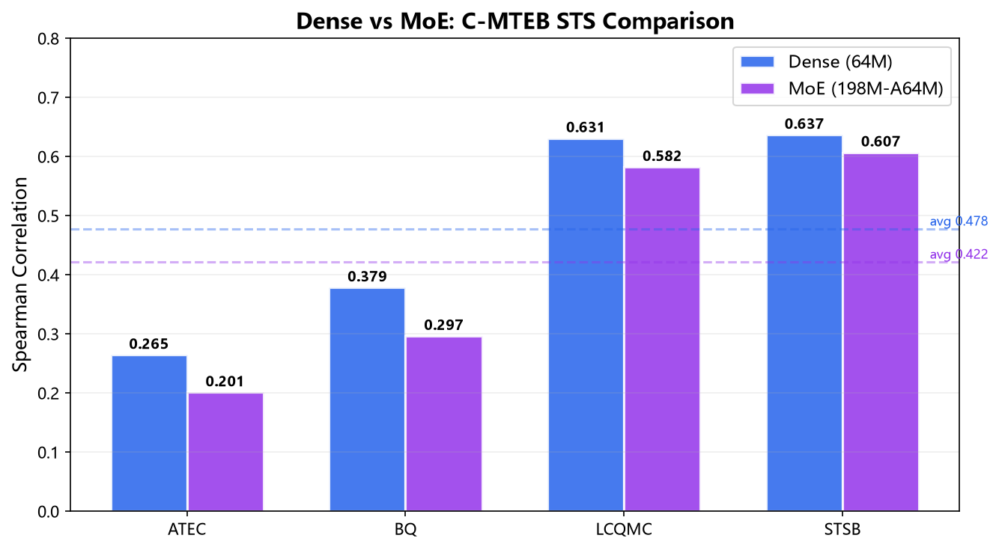

</div>

四个 STS 任务 Dense **全面领先** MoE,且差距在 ATEC/BQ 这种难度更高的任务上更大(-0.064 / -0.082),说明 MoE 的劣势在语义粒度更细的任务上被放大。

### 结果分析

1. **🔴 反直觉发现：MoE(198M) 比 Dense(64M) 差 11.7%**（0.422 vs 0.478）。这是一次**严格受控对比**（同数据、同超参、同流程，唯一区别是架构），结论很有研究价值。三个原因:
   - **MoE fragmentation（专家割裂）**：top-1 routing 让每个 token 只走 1/4 expert,不同 token 走不同 expert,表示空间被"割裂"成多个子空间。embedding 需要把整句压成一个向量做全局语义聚合,而碎片化的 token 表示在 last-token pooling 时难以被连贯地整合——这是 MoE 在 embedding 任务上水土不服的根源。
   - **激活参数其实相同（active params 持平）**：MoE 总参 198M,但每个 token 只激活 ~64M(与 Dense 相同)。也就是说 MoE 相比 Dense **没有多花任何"激活算力"**,却付出了路由开销与碎片化的代价——参数总量翻 3 倍但有效容量没涨,在小数据量下纯属浪费。
   - **routing overhead（路由开销与欠训练）**：router 把每个 token 分配到 expert 的过程本身不产生语义,反而引入了需要额外训练的参数。在本项目有限数据下(Stage1 仅 9 万对 vs Qwen3 的 1.5 亿),router 根本没学好,专家分工不明确,路由是噪声而非能力。
   - **这恰好印证了 Qwen3 团队的设计选择**：[Qwen3-Embedding 全系列都是 dense 架构](https://arxiv.org/abs/2506.05176)（0.6B/4B/8B），没有 MoE 版本——**embedding 模型就该用 dense**。
2. **Stage3 SLERP 融合 vs Stage2 未融合**：Dense 两者几乎一致（0.4778 vs 0.4777）。在小模型上，训练后期的多个 checkpoint 本身已经很接近，融合的边际收益不明显。
3. **3 epoch vs 1 epoch**：持平（均约 0.48）。模型在 1 epoch 已收敛到该数据/架构的上限，更多 epoch 没带来 STS 提升（虽 train loss 持续降，但属过拟合 train set）。
4. **瓶颈定位**：LCQMC/STSB 较强（0.63/0.64），ATEC/BQ 较弱（0.27/0.38）。根本瓶颈在 **minimind 底座 vocab=6400**（中文压缩比弱）+ **Stage1 数据量不足**（9万 vs Qwen3 的 1.5亿）。

<div align="center">

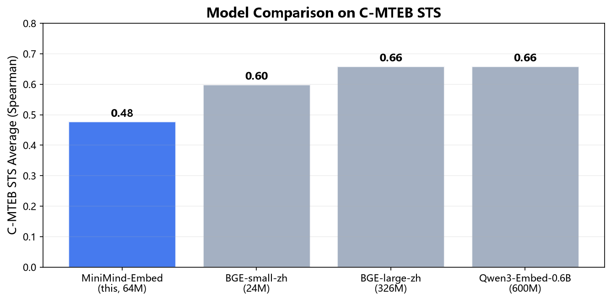

</div>

> **对比参考**：BGE-small-zh 约 0.55~0.65，Qwen3-Embedding-0.6B 约 0.66。本模型 Dense 64M、vocab 6400，STS 0.478 受限于底座，但完整复现了 Qwen3-Embedding 三阶段技术路线。

详细 JSON：见 `results/sts_stage3.json`（Dense）、`results/sts_moe_stage3.json`（MoE）。

## Ⅱ Rerank 结果

| 方案 | T2Reranking MAP@10 | 说明 |
|------|:---:|------|
| **纯预训练底座(零样本)** | **0.4666** | ✅ 最佳。直接用 rerank prompt 让模型预测"是/否" |
| pointwise 微调(v1/v2) | 0.24 | ❌ 灾难性遗忘,详见下方分析 |

**重要发现**：对 minimind 这种 64M 小底座,**全参数 pointwise 微调反而破坏了预训练已有的判别能力**(MAP@10 从 0.47 降至 0.24)。Qwen3-Reranker 能用同样方法成功,是因为 0.6B+ 参数足以"同时保留预训练知识 + 学新任务"。小模型的 reranker 改进方向:冻结底座/LoRA/listwise loss。

详细 JSON：见 `results/rerank_pretrain_baseline.json`。

## Ⅱ MTEB 英文结果

> ⏳ 待补充。

## Ⅲ Reranking 结果

> ⏳ 待补充。

## Ⅳ 怎么复现评测

```bash
# Embedding 评测(C-MTEB 全 35 任务)
# 详见 scripts/eval_mteb.py(M2 补充)
docker compose -f docker/docker-compose.yml run --rm dev python scripts/eval_mteb.py \
    --model checkpoints/embedding/embedding_stage2_768.pth \
    --benchmark C-MTEB
```

---

# 📌 其他

## 🐳 Docker 训练（租 GPU 无缝切换）

本项目提供完整的 Docker 环境，便于在本地 RTX 5080 与租用的 A100/H100 之间无缝迁移：

```bash
# 本地构建镜像
docker compose -f docker/docker-compose.yml build

# 导出镜像(传到租用的 GPU 机器)
docker save minimind-embed:latest | gzip > minimind-embed.tar.gz

# 在租用机器上加载
docker load < minimind-embed.tar.gz
# 然后挂载代码目录即可继续训练
```

镜像基于 `nvidia/cuda:13.3.0-cudnn-devel-ubuntu24.04`，预装：
- Python 3.12 + torch 2.13.0+cu130（Blackwell sm_120 支持）
- transformers 5.x + datasets + accelerate
- mteb 2.18 + sentence-transformers 5.6（评测与打包）

## 👨‍💻 更多内容

<details>
<summary><b>❓ FAQ</b></summary>

**Q: 为什么不用 BERT 风格的双向 attention + mean pooling？**
A: 为了最大化复用 MiniMind 的预训练权重。causal LM 配 last-token pooling 是 Qwen3-Embedding 验证过的高效路线，预训练分布一致，无需重新预热。详见 [模型 > Last-token Pooling 原理](#last-token-pooling-原理)。

**Q: RTX 5080 真的能跑完整训练吗？**
A: Dense 64M 版本完全可以（显存占用 ~12-14GB）。MoE 198M 长序列训练可能需要降 batch 或开梯度检查点，建议租 A100。详见 [实验 > 训练开销](#-训练开销)。

**Q: 为什么温度 τ=0.02？**
A: Qwen3-Embedding 报告未公布具体值，社区复现常用 0.02~0.05。0.02 是 InfoNCE 的经验最佳点（使相似度差异足够尖锐，便于区分正负样本）。

**Q: 为什么用"是"/"否"而不是新增 `<yes>`/`<no>`？**
A: 实验发现，新增 token 的 embedding 是随机初始化的，64M 小模型在低 lr 下难以学好"相关性 → 新 token"的映射，导致 rerank 分数反而下降（灾难性遗忘）。改用词表中现成的 `是`(id=357)/`否`(id=1332)——它们是单 token、语义明确、预训练见过无数次的中文词，直接复用效果最好（零样本 MAP@10 就达 0.47）。

</details>

---

# 📌 致谢

> [!NOTE]
> 如果本项目对您有所帮助，欢迎在 GitHub 上点亮一个 ⭐<br/>
> 文档与代码难免存在疏漏，欢迎通过 Issues 交流反馈，或提交 PR 一起改进项目<br/>
> 您的支持与建议，都是这个项目持续迭代的重要动力！

## 🤝 致谢

本项目站在以下项目的肩膀上，深表感谢：

- **[MiniMind](https://github.com/jingyaogong/minimind)** by [@jingyaogong](https://github.com/jingyaogong) —— 提供了优秀的 64M 小型语言模型底座与完整训练链路。没有 MiniMind 的"大道至简"理念，就没有本项目的"向量化万物的最小起点"。
- **[Qwen3-Embedding](https://arxiv.org/abs/2506.05176)** by Qwen Team —— 提供了 causal + last-token pooling + 假负样本 mask + pointwise rerank 的完整技术路线，本项目的核心方法均来自该报告。

## 😊 鸣谢数据与工具

- [T2Ranking](https://huggingface.co/datasets/THUIR/T2Ranking)、[mMARCO](https://huggingface.co/datasets/unicamp-dl/mmarco)、[C-MTEB](https://github.com/embeddings-benchmark/mteb)、[sentence-transformers](https://www.sbert.net/) 等开源数据集与工具。

---

# 🎓 引用

如果本项目对您的研究有帮助，请引用：

```bibtex
@misc{minimind-embeddings,
  title  = {MiniMind-Embedding: A Small Embedding and Rerank Model Based on MiniMind},
  author = {muzian666},
  year   = {2026},
  url    = {https://github.com/muzian666/minimind-embedding},
  note   = {Based on MiniMind, inspired by Qwen3-Embedding}
}

@misc{minimind,
  title  = {MiniMind: Train a Tiny LLM from Scratch},
  author = {Jingyao Gong},
  year   = {2024},
  url    = {https://github.com/jingyaogong/minimind}
}

@article{qwen3embedding,
  title  = {Qwen3 Embedding: Advancing Text Embedding and Reranking Through LLMs},
  author = {Zhang, Y. and others},
  year   = {2025},
  url    = {https://arxiv.org/abs/2506.05176}
}
```

---

# ⚖️ 开源协议

本项目基于 [Apache License 2.0](./LICENSE) 开源，完全免费。
