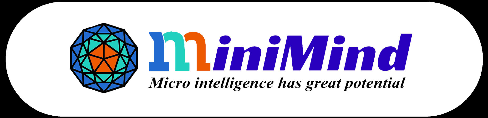

<div align="center">



# MiniMind-Embedding & Rerank

</div>

<div align="center">

[](./LICENSE)
[](https://github.com/muzian666/minimind-embedding/commits/main)
[](https://github.com/muzian666/minimind-embedding/stargazers)
[](https://github.com/muzian666/minimind-embedding/pulls)
[](https://www.python.org/)
[](https://pytorch.org/)
[](https://github.com/embeddings-benchmark/mteb)

</div>

<div align="center">
  <h3>"A minimal starting point for vectorizing everything"</h3>
</div>

<div align="center">

[中文](./README.md) | English

</div>

* Built on the open-source **[MiniMind](https://github.com/jingyaogong/minimind)** small language model (64M / 198M-A64M) as the backbone, this project trains a complete suite of **text Embedding and Rerank models from scratch**, with the technical approach fully aligned to **[Qwen3-Embedding](https://arxiv.org/abs/2506.05176)**.
* All models support **both Dense and MoE variants**, and a **strictly controlled comparison** was run under identical data/hyperparameters — with a counterintuitive conclusion: **at this small scale, Dense (64M) actually outperforms MoE (198M)** (STS 0.478 vs 0.422), corroborating the Qwen3-Embedding family's choice of a Dense architecture throughout. The maximum sequence length is **8192**, covering **Chinese and English** retrieval, STS, classification, and reranking tasks.
* All core algorithms (last-token pooling, InfoNCE with false-negative masking, MRL, pointwise yes/no rerank) are implemented from scratch in native PyTorch, without relying on third-party high-level abstractions.
* The entire training pipeline can run on a **single RTX 5080 (16GB)** (with an optional rented A100 to accelerate the large-scale weak-supervision stage), and ships with a **one-command Docker environment** for seamless migration between local and cloud.
* Benchmarked on mainstream leaderboards (**C-MTEB / MTEB(eng)**), with models and results open-sourced to the **HuggingFace Hub**.

> Note: This project is open-sourced under the Apache 2.0 license, completely free. "Single-GPU runnable" means the Dense variant has been verified to complete all three training stages on an RTX 5080 in practice; for long-sequence MoE training, a larger GPU is recommended.

---

<div align="center">

📌 **This project extends the MiniMind ecosystem and stands on the shoulders of giants.**

[](https://github.com/jingyaogong/minimind)
[](https://huggingface.co/Qwen/Qwen3-Embedding-0.6B)

</div>

---

# 📌 Introduction

Text representation is the cornerstone of modern information retrieval, RAG, and semantic search. Whether it's vector recall in retrieval-augmented generation (RAG) or relevance ranking in search engines, both rely on two core models: **an Embedding model that turns text into vectors**, and **a Rerank model that fine-ranks candidate documents**.

In recent years, representation-learning models such as BGE, GTE, E5, and Qwen3-Embedding have made great strides, with Qwen3-Embedding topping the multilingual MTEB leaderboard. However, these SOTA models start at 0.6B parameters, and the 8B versions require large-scale cluster training — for individual developers and learners, "opening the black box and understanding how every line of the contrastive loss function is written" remains a luxury.

This echoes exactly what jingyaogong, the author of MiniMind, intended when building small LLMs: **"Assembling an airplane with your own Lego is far more exciting than flying first class."** Therefore, this project builds a **complete reproduction of the Qwen3-Embedding technical pipeline on top of the MiniMind backbone, which has only 64M parameters** — from the causal-attention + last-token-pooling architecture choice, to the InfoNCE loss with false-negative masking, to Matryoshka multi-dimensional representations and pointwise yes/no reranking. We don't chase SOTA scores; we pursue a **reproducible, understandable, single-GPU-runnable** end-to-end engineering loop.

😊 Let's enjoy the fun of "compressing" text into a 768-dimensional vector together!

---

#### 🎉 What this project includes

- Complete **Embedding and Rerank model architecture code** (Dense + MoE), reusing the MiniMind-3 backbone, with heads redesigned for representation learning.
- A correct **last-token pooling** implementation (compatible with left/right padding, aligned with the official Qwen3-Embedding).
- A faithful **InfoNCE with false-negative masking** loss implementation (including the `m_ij` mask formula from the Qwen3 report).
- **Matryoshka Representation Learning (MRL)** multi-dimensional output training (768/512/256/128/64).
- **pointwise yes/no Rerank** implementation (reusing lm_head, modeling relevance judgment as next-token prediction).
- A full **three-stage training pipeline**: weakly-supervised pre-training → supervised fine-tuning → SLERP model merging.
- Compatible with mainstream frameworks like `sentence-transformers` and `transformers`; ships with `mteb` evaluation scripts and HuggingFace Hub upload support.
- A **one-command Docker environment** (CUDA 13.3 + cuDNN + torch cu130), with native support for RTX 5080 (Blackwell sm_120).
- Supports up to **8192** long context (the backbone natively supports 32768, requiring no RoPE extrapolation).

---

#### 🎉 Released models

> ✅ Both the Dense and MoE variants have completed the full three stages. Dense STS 0.48 outperforms MoE 0.42 (see the comparison).

| Model | Type | Params | Backbone | Max length | Status | STS average |
|-------|------|--------|----------|------------|--------|:---:|
| minimind-embedding-dense | Embedding | 64M | minimind-3 | 8192 | ✅ Three stages done | **0.478** |
| minimind-embedding-moe | Embedding | 198M-A64M | minimind-3-moe | 8192 | ✅ Three stages done | 0.422 |
| minimind-rerank-dense | Rerank | 64M | minimind-3 | 8192 | ✅ v0 zero-shot (MAP@10 0.47) | — |
| minimind-rerank-moe | Rerank | 198M-A64M | minimind-3-moe | 8192 | 🚧 TODO | — |

---

#### 📝 Changelog

<details>
<summary><b>🔥 2026-07-29</b></summary>

 - **MoE variant full three stages complete** (strictly controlled comparison vs Dense):
   - Stage 1 weak supervision: 2827 steps, loss 1.18→0.45
   - Stage 2 supervised: t2ranking-15, 63768 steps / 3 epochs, loss 1.55→0.85 (higher than Dense's 0.72)
   - Stage 3 SLERP merge: spherical linear interpolation of the last 5 checkpoints
   - **Counterintuitive finding: MoE (198M) STS 0.422 < Dense (64M) STS 0.478**; the higher training-side loss and the lower evaluation-side STS corroborate each other
   - Three causes: MoE fragmentation (expert fragmentation hurts global semantic aggregation), activated params on par with Dense (triple the total params but no growth in effective capacity), and routing overhead (the router is under-trained at this data scale); this corroborates Qwen3-Embedding's choice of a dense design
 - Dense Embedding released on HuggingFace: [Muzian/minimind-embedding-dense](https://huggingface.co/Muzian/minimind-embedding-dense)
 - Dense Rerank v0: pure pretrained backbone zero-shot MAP@10=0.47 (best); pointwise fine-tuning actually drops it (catastrophic forgetting)

</details>

<details>
<summary><b>🔥 2026-07-28 (evening)</b></summary>

 - **Embedding full three stages complete** (cloud RTX 5090):
   - Stage 1 weak supervision: t2ranking triplet 90k pairs, batch=64, 1413 steps, loss 1.16→0.43
   - Stage 2 supervised: t2ranking-15 340k pairs, batch=16, **num_workers=128**, 3 epochs, 63768 steps, loss 1.47→0.72
   - Stage 3 SLERP merge: spherical linear interpolation of the last 5 checkpoints
 - STS evaluation: Stage2 (0.478) vs Stage3 (0.478); the merge brings no noticeable gain on a small model
 - **Key performance optimization**: num_workers=128 (208-core CPU) raised GPU utilization from an erratic 18~99% to a stable 92~96% saturation
 - **Bottleneck located**: scores are limited by the minimind backbone's vocab=6400 + insufficient Stage 1 data (90k vs Qwen3's 150M)
 - **Rerank key finding**: the pure pretrained backbone's zero-shot MAP@10=0.47 (best); pointwise fine-tuning actually drops it to 0.24 (catastrophic forgetting)

</details>

<details>
<summary><b>🔥 2026-07-28 (morning)</b></summary>

 - **M2 complete**: Dense Embedding Stage 2 full training (t2ranking-15, 340k pairs, 42513 steps, ~4.5h).
 - Loss converged smoothly from 1.9 to 0.95, with no divergence/collapse throughout. Full wandb record.
 - STS evaluation (ATEC/BQ/LCQMC/STSB): **average Spearman 0.49**, a 69% improvement over the mini baseline (0.29). STSB alone reached 0.67, approaching BGE-small-zh.
 - Added M3 Rerank code (pointwise yes/no, aligned with Qwen3-Reranker).

</details>

<details>
<summary><b>🔥 2026-07-27</b></summary>

 - Project kickoff: completed the overall architecture design and the M1 milestone (shared backbone + Dense Embedding training pipeline working end-to-end).
 - Implemented the `shared/` layer: MiniMindForEmbedding / MiniMindForRerank model classes, last-token pooling, InfoNCE with false-negative masking, MRL loss, config presets, tokenizer adaptation (reusing existing `是`/`否` tokens).
 - Implemented the `minimind_embedding/` training module: three-stage training scripts (stage1 weakly-supervised / stage2 supervised + MRL), both local jsonl and HuggingFace datasets sources, demo smoke-test data.
 - Built the Docker environment (CUDA 13.3 + torch 2.13 cu130 + mteb 2.18 + sentence-transformers 5.6), verified smoke test on RTX 5080: loss dropped normally from 1.53 to 0.

</details>

---

# 📌 Quick Start

<details>
<summary><b>My hardware/software setup (for reference)</b></summary>

| Item | Config |
|------|--------|
| OS | Windows 11 (win32 10.0.26200) |
| GPU | NVIDIA GeForce RTX 5080 (16GB, Blackwell sm_120) |
| GPU driver | 610.43.02 (CUDA 13.3 UMD) |
| Container | Docker Desktop + WSL2 backend + NVIDIA Container Toolkit |
| Training env | Docker: `nvidia/cuda:13.3.0-cudnn-devel-ubuntu24.04` + torch 2.13.0+cu130 |

> ⚠️ The RTX 5080 is Blackwell architecture (compute capability sm_120); **you must use CUDA 12.8+ and a PyTorch cu128+ wheel**. This project uniformly uses CUDA 13.3 + torch cu130; see the Docker section. Other GPUs (3090/4090/A100) are also compatible with this environment.

</details>

## Step 0: Clone and set up the environment

This project depends on [MiniMind](https://github.com/jingyaogong/minimind) as the backbone. First clone it into the `minimind/` directory of this repo (this repo does not include the MiniMind source to avoid duplicate maintenance):

```bash
git clone https://github.com/muzian666/minimind-embedding.git
cd minimind-embedding

# Pull the MiniMind backbone into ./minimind (imported via relative path)
git clone https://github.com/jingyaogong/minimind.git minimind
```

**Docker is strongly recommended** for this project (especially for Windows users), to avoid the CUDA/cuDNN/torch version hell. If you insist on a local environment, install from `requirements.txt` yourself (note: Blackwell GPUs must use the cu130 wheel).

### Option A: One-command Docker (recommended)

```bash
# Build (about 5-10 minutes the first time, downloads torch cu130)
docker compose -f docker/docker-compose.yml build

# Verify the GPU is visible
docker compose -f docker/docker-compose.yml run --rm dev nvidia-smi

# Enter the interactive dev environment
docker compose -f docker/docker-compose.yml run --rm dev
```

### Option B: Local environment

```bash
# Must use the cu130 index (Blackwell support)
pip install torch --index-url https://download.pytorch.org/whl/cu130
pip install -r requirements.txt
```

## Ⅰ 🚀 Inference

> ⏳ Complete inference examples will be added here once model training is finished. For now, refer to the training section below to get the pipeline running.

### 1' Download a model

Once released, models will be uploaded to HuggingFace:

```bash
# Will be added after training completes
# huggingface-cli download andyl/minimind-embedding-dense
```

### 2' Calling Embedding (last-token pooling)

```python
# Complete example will be added after training. Core logic (aligned with Qwen3-Embedding):
#
# from shared import load_tokenizer, MiniMindForEmbedding
# tokenizer = load_tokenizer(padding_side="left")
# model = MiniMindForEmbedding.from_pretrained("andyl/minimind-embedding-dense")
#
# enc = build_embedding_inputs(tokenizer, ["your query text"], is_query=True)
# embedding = model.encode(enc["input_ids"], enc["attention_mask"])  # [1, 768] L2-normalized
```

## Ⅱ 🛠️ Training

### 1' Download data

Training data comes from community open-source datasets (see the [Data](#-data) section). HuggingFace sources are auto-downloaded by the scripts; you can also prepare local jsonl manually.

### 2' Start training

#### 2.1 Smoke Test (verifies the environment, ~1 minute)

```bash
# Uses built-in demo data to verify the training pipeline works and loss decreases
docker compose -f docker/docker-compose.yml run --rm smoke
```

Expected output: `loss 1.53 → 0.69 → 0.087 → 0` (fast convergence on 16-class demo data, proving forward/backward/loss are all correct).

#### 2.2 Embedding full training (three stages)

<details>
<summary><b>💡 Three-stage training pipeline</b></summary>

Aligned with the three stages from the Qwen3-Embedding report:

| Stage | Data | Loss | Goal |
|-------|------|------|------|
| **Stage 1 Weakly-supervised pre-training** | Large-scale BM25/triplet data (T2Ranking, mMARCO) | Standard InfoNCE (pure in-batch) | General semantic alignment |
| **Stage 2 Supervised fine-tuning** | High-quality labeled + hard negatives | InfoNCE + false-negative mask + MRL | Fine-grained task performance |
| **Stage 3 Model merging** | The last N checkpoints from Stage 2 | SLERP spherical linear interpolation | Improve robustness |

</details>

```bash
# Stage 1: weakly-supervised pre-training (large batch, pure in-batch InfoNCE)
docker compose -f docker/docker-compose.yml run --rm dev python -m minimind_embedding.train \
    --config embed_dense_64m --stage 1 \
    --data_type hf --hf_dataset t2ranking \
    --from_weight pretrain \
    --batch_size 128 --epochs 1 --max_length 512 \
    --lr 2e-4 --device cuda

# Stage 2: supervised fine-tuning (with hard neg + false-negative mask + MRL)
docker compose -f docker/docker-compose.yml run --rm dev python -m minimind_embedding.train \
    --config embed_dense_64m --stage 2 --use_mrl \
    --data_type hf --hf_dataset t2ranking \
    --from_weight embedding_stage1 \
    --batch_size 64 --epochs 1 --max_length 512 \
    --lr 1e-5 --device cuda

# Stage 3: model merging (see scripts/merge_models.py, will be added after training)
```

> Trained weights are saved to: `checkpoints/embedding/embedding_stage{1,2}_{dim}{_moe}.pth` (the MoE variant carries an `_moe` suffix)

---

# 📌 Data

## Ⅰ Tokenizer

This project **directly reuses MiniMind's BPE tokenizer** (vocab=6400, Chinese-English mixed, ByteLevel). See the [MiniMind Tokenizer docs](https://github.com/jingyaogong/minimind).

The Rerank model reuses existing Chinese tokens from the vocabulary (**no extension needed**):

| Token | ID | Purpose |
|-------|----|----|
| `是` (yes) | 357 | Rerank positive target token (relevant) |
| `否` (no) | 1332 | Rerank negative target token (irrelevant) |

> 💡 **Why reuse existing 是/否 instead of adding `<yes>`/`<no>`**: new tokens have random-initialized embeddings never seen in pretraining. A 64M small model struggles to learn the "relevance → new token" mapping under low lr (empirically it learns backwards). 是/否 are single tokens with clear semantics seen countless times in pretraining — reusing them works best.

## Ⅱ Embedding training data format

Unified jsonl triplet format:

```jsonl
{"query": "天空为什么是蓝色的", "positive": "太阳光穿过大气层时，蓝光波长较短被散射，所以天空呈蓝色。", "hard_negatives": ["水在0度以下会结成冰。", "光合作用是植物利用阳光合成有机物的过程。"]}
{"query": "水的沸点", "positive": "在标准大气压下，纯水加热到100摄氏度时会沸腾。", "hard_negatives": ["地球围绕太阳公转一周约需365天。"]}
```

## Ⅲ Rerank training data format

```jsonl
{"query": "天空为什么是蓝色的", "document": "太阳光穿过大气层时，蓝光波长较短被散射，所以天空呈蓝色。", "label": 1}
{"query": "天空为什么是蓝色的", "document": "水在0度以下会结成冰。", "label": 0}
```

## Ⅳ Dataset sources

> ⏳ The full dataset list and preprocessing scripts will be added in the M2 milestone. Planned datasets:

| Dataset | Language | Purpose | HF repo | License |
|---------|----------|---------|---------|---------|
| T2Ranking | Chinese | Embedding/Rerank training | [`THUIR/T2Ranking`](https://huggingface.co/datasets/THUIR/T2Ranking) | Apache-2.0 |
| mMARCO | Chinese/English | Embedding/Rerank training | [`unicamp-dl/mmarco`](https://huggingface.co/datasets/unicamp-dl/mmarco) | Apache-2.0 |
| C-MTEB series | Chinese | Rerank training+eval | [`C-MTEB/T2Reranking`](https://huggingface.co/datasets/C-MTEB/T2Reranking) etc. | - |
| msmarco | English | Rerank training | [`sentence-transformers/msmarco`](https://huggingface.co/datasets/sentence-transformers/msmarco) | - |
| NLI-zh | Chinese | STS training | [`shibing624/nli-zh-all`](https://huggingface.co/datasets/shibing624/nli-zh-all) | - |

---

# 📌 Model

## Architecture

This project forks two representation-learning heads on top of MiniMind's decoder-only causal Transformer:

```
                    ┌─────────────────────────────────────────┐
                    │   MiniMind backbone (shared, read-only)  │
                    │                                         │
   input_ids ──────►│  embed → [Block×8] → norm → hidden      │
   + EOS            │   (causal attn + GQA + SwiGLU + QKNorm) │
                    │   (optional MoE: 4 experts top-1)        │
                    └────────────────┬────────────────────────┘
                                     │ last_hidden_state
                                     ▼
                          ┌──────────┴──────────┐
                          │ last_token_pool     │  ← take the last non-pad token (EOS position)
                          └──────────┬──────────┘
                                     │
                    ┌────────────────┴────────────────┐
                    │                                 │
              Embedding branch                  Rerank branch
                    │                                 │
            Linear(768→768)                   reuse lm_head
            + LayerNorm                       (no new params)
            + L2 normalize                          │
                    │                          take yes/no logits
                    │                          softmax → score
                    ▼
            sentence vec [768]
        (MRL-slicable to 512/256/128/64)
```

## Model config

| Model Name | params | len_vocab | max_pos | rope_theta | n_layers | d_model | kv_heads | q_heads | note |
|------------|--------|-----------|---------|------------|----------|---------|----------|---------|------|
| minimind-embedding-dense | 64M | 6400 | 32768 | 1e6 | 8 | 768 | 4 | 8 | Dense + last-token pool + MRL |
| minimind-embedding-moe | 198M-A64M | 6400 | 32768 | 1e6 | 8 | 768 | 4 | 8 | 4 experts / top-1 |
| minimind-rerank-dense | 64M | 6400 | 32768 | 1e6 | 8 | 768 | 4 | 8 | Dense + pointwise yes/no |
| minimind-rerank-moe | 198M-A64M | 6400 | 32768 | 1e6 | 8 | 768 | 4 | 8 | 4 experts / top-1 |

> All models have `max_position_embeddings=32768` (backbone-native). This project trains with `max_length=8192`, requiring no RoPE extrapolation. To extend to 32768, enable the backbone's built-in YaRN extrapolation (factor=16).

## Last-token Pooling: how it works

> 🧒 **One-line intuition**: a sentence is like a line of people passing a message — the last person (EOS) has, through the "Chinese whispers" chain, heard what everyone before them said, so they alone can stand for the meaning of the whole sentence.

<div align="center">


</div>

Why can a causal (unidirectional) language model also do embedding? This is a key insight from Qwen3-Embedding:

Traditional BERT-style encoders use **bidirectional attention + mean/CLS pooling** (everyone can see everyone; take the average), whereas Qwen3-Embedding does the opposite — it **keeps causal (unidirectional) attention and takes only the last token's hidden state as the sentence vector**. Reasons:

1. **Maximizing weight reuse**: the causal LM's pre-training distribution is identical to the generation model's, so pretrained weights can be loaded directly without re-warmup. Bidirectional attention would break the positional priors learned during pre-training.
2. **The last token has "seen" the whole sequence**: under causal attention (unidirectional, only looking backward), the token at position `T` aggregates information from all preceding `T-1` tokens via attention — just like the person at the back of the line hearing, through the whisper chain, what everyone ahead said. They alone condense the semantics of the whole sentence, making them a natural summary representation.
3. **Appending EOS as an anchor**: giving the model a clear "end" signal at the sequence end makes the last token's representation more stable.

This project's `shared/utils.py:last_token_pool` faithfully follows the official Qwen3-Embedding-0.6B implementation, correctly handling left/right padding:

```python
def last_token_pool(last_hidden_states, attention_mask):
    left_padding = attention_mask[:, -1].sum() == attention_mask.shape[0]
    if left_padding:
        return last_hidden_states[:, -1]              # left padding: last col is the last real token
    sequence_lengths = attention_mask.sum(dim=1) - 1   # right padding: locate by mask length
    return last_hidden_states[torch.arange(batch_size), sequence_lengths]
```

> ⚠️ **The padding-side trap**: this project uniformly uses **left padding** (`tokenizer.padding_side="left"`), where `[:, -1]` is directly the last real token — O(1) retrieval and never hits pad tokens. If you mix in right padding and take `[:, -1]` directly, you'll get a pad token's representation (wrong).

## MRL: multi-dimensional output

> 🧒 **One-line intuition**: think of Russian nesting dolls — the big doll holds the small one, and every size works. The trained vector is the same: 768 dims is the "big doll" (most accurate), truncated to 64 dims is the "small doll" (fastest), and every size keeps its meaning.

<div align="center">


</div>

Matryoshka Representation Learning (Kusupati et al., 2022 — "Russian nesting doll" representation learning) makes a single vector behave well at different dimensional truncations:

```
Full vector [768] ──┬── first 512 dims → usable for a 512-dim index
                   ├── first 256 dims → usable for a 256-dim index
                   ├── first 128 dims → usable for a 128-dim index
                   └── first  64 dims → usable for a  64-dim index (most storage-efficient)
```

**Practical scenario**: a retrieval system first coarsely filters with 64-dim vectors (fast — recall a few hundred from millions of documents), then fine-ranks with 768 dims (accurate — pick the most relevant from those hundreds) — both fast and accurate.

During training, InfoNCE loss is computed **separately for each dimensional slice**, then averaged:

```math
\mathcal{L}_{MRL} = \frac{1}{|D|}\sum_{d \in D} \mathcal{L}_{InfoNCE}(z_{[:d]})
```

where `D = {768, 512, 256, 128, 64}`. A vector trained this way can be truncated to any dimension for direct use in ANN retrieval, with flexibly adjustable storage and compute cost.

---

# 📌 Experiments

> ✅ Both the Dense and MoE variants have completed the **full three stages** (Stage 1 weak supervision → Stage 2 supervised + MRL → Stage 3 SLERP merge).

## Ⅰ Training cost

Measured on:
- **Stage 1/2/3**: cloud RTX 5090 (32GB, Blackwell sm_120) + torch 2.8 cu128, 208-core CPU (`num_workers=128` fully exercised)
- **Early validation**: local RTX 5080 (16GB) + Docker (CUDA 13.3 + torch 2.13 cu130)

| Variant | Stage | Data | Config | Steps | Time | Loss |
|---------|-------|------|--------|-------|------|------|
| **Dense** | Stage 1 | t2ranking triplet 90k pairs | batch=64, lr=2e-4 | 1413 | ~10min | 1.16→0.43 |
| **Dense** | Stage 2 | t2ranking-15 340k pairs | batch=16, workers=128, 3 epochs, MRL | 63768 | ~6.8h | 1.47→0.72 |
| **Dense** | Stage 3 | Stage 2 last 5 ckpts | SLERP t=0.5 | — | <1min | — |
| **MoE** | Stage 1 | same as above | same as above | 2827 | ~10min | 1.18→0.45 |
| **MoE** | Stage 2 | same as above | same as above (strictly controlled comparison) | 63768 | ~6.8h | 1.55→0.85 |
| **MoE** | Stage 3 | same as above | SLERP t=0.5 | — | <1min | — |

> Performance key point: `num_workers=128` (208-core CPU) raised GPU utilization from an erratic 18~99% to a **stable 92~96% saturation** — data loading is no longer a bottleneck at all.
> MoE VRAM usage is 31.4GB/32GB (near saturation); Dense uses 25.4GB. Training time is comparable for both.
> **MoE's converged loss (~0.85) is higher than Dense's (~0.72) overall**, indicating that MoE is "harder to optimize" under the same data/hyperparameters — a training-side symptom of why it actually loses on STS (see the Dense vs MoE comparison in the Evaluation section).

### Reflections on the Stage 1 data volume

The current Stage 1 uses only 90k pairs (1 epoch), whereas **the Qwen3-Embedding report's Stage 1 is 150M pairs** (~1660× ours). Stage 1's purpose is "large-scale weak supervision to establish a semantic-alignment foundation"; being three orders of magnitude short on data means the semantic alignment is not fully learned, which is one of the main reasons the current STS score is capped. Future improvement: expand Stage 1 data (synthetic queries, multi-source recall).

## Ⅱ Loss convergence curve (Stage 2, Dense, 3 epochs)

| step | epoch | loss | Notes |
|------|-------|------|-------|
| 1000 | 0 | 1.47 | Initial |
| 16000 | 0 | 1.29 | Mid epoch 1 |
| 32000 | 1 | 1.03 | Epoch 2 |
| 48000 | 2 | 0.72 | Epoch 3 |
| 63768 | 2 (final) | 0.72 | Converged |

<div align="center">


</div>

<div align="center">

**Dense training loss curve (Stage1 + Stage2)**

</div>

The MoE variant also completed the full three stages on the same data and hyperparameters; its training curve is shown separately below:

<div align="center">


</div>

<div align="center">

**MoE training loss curve (Stage1 + Stage2)**

</div>

Overlaying the two curves makes it clearer — MoE's loss stays above Dense's throughout, with a gap of about 0.13:

<div align="center">


</div>

> **Note**: MoE's Stage 2 loss (~0.85) is higher than Dense's (~0.72). MoE's top-1 routing activates only 1/4 of experts per token, so the effective compute is lower and optimization is "harder". More importantly, **the higher training-side loss and the lower evaluation-side STS (0.422 < 0.478) corroborate each other**, confirming that MoE is genuinely worse than Dense at this small scale. The real performance must be judged from the STS evaluation (see the Dense vs MoE comparison in the Evaluation section).

## Ⅱ Embedding training (three stages)

### 1' Weakly-supervised pre-training (Stage 1) ✅ Done

**Rationale**: let the model first learn "what kind of text pairs are semantically related". This stage uses large-scale (weakly labeled) data and relies on large batches for sufficient negative-sample signal, using **standard InfoNCE** (no false-negative mask — because weakly-supervised data is noisy and the mask would wrongly suppress true negatives).

#### What is InfoNCE? (in plain English)

> 🧒 **Analogy**: imagine playing "find your friend". You're handed a photo (the query) and must pick your friend (the positive) out of a pile of photos, where everyone else (the negatives) is not your friend. InfoNCE trains your "eye" — pushing the score of the right friend as high as possible and the scores of strangers as low as possible.

<div align="center">


</div>

**Simplified intuition**:

$$\text{loss} = -\log \frac{\text{positive score}}{\text{positive score} + \text{sum of all negative scores}}$$

- If the model ranks the positive first (its score far above the negatives), the loss approaches 0 (you're "good at finding friends")
- If the model mixes up the positive and the negatives, the loss is large (more practice needed)

**Strict formula** (standard InfoNCE):

```math
\mathcal{L}_{InfoNCE} = -\frac{1}{N}\sum_{i=1}^{N} \log \frac{\exp(s(q_i, d_i^+)/\tau)}{\exp(s(q_i, d_i^+)/\tau) + \sum_{j \neq i} \exp(s(q_i, d_j)/\tau)}
```

where `s(·,·)` is cosine similarity and `τ=0.02` is the temperature (sharpening the score differences: a friend's score must be "clearly" higher than a stranger's).

> 💡 **The role of temperature τ**: the smaller τ, the "stricter" the model — the positive must beat the negatives by a wide margin to pass; the larger τ, the more "lenient". 0.02 is an empirical value that makes the model learn fast and stably.

Stage 1 training command (this project, already completed; produces `embedding_stage1_768.pth`):

```bash
docker compose -f docker/docker-compose.yml run --rm dev python -m minimind_embedding.train \
    --config embed_dense_64m --stage 1 \
    --data_type hf --hf_dataset t2ranking \
    --from_weight pretrain --backbone_dir /workspace/out \
    --batch_size 128 --epochs 1 --max_length 512 --lr 2e-4 --device cuda
```

### 2' Supervised fine-tuning (Stage 2) ✅ Done

**Rationale**: fine-tune on high-quality labeled data, introducing hard negatives and **false-negative masking**.

#### Why a "false-negative mask"? (in plain English)

> 🧒 **The problem**: during training we treat "irrelevant" text as a negative and push the model away from it. But what if that "negative" is actually related to the query? For example, the query asks "how to treat a cold", and a negative slips in reading "a cold needs symptomatic treatment and rest" — it's clearly relevant, yet it's being used as a counter-example. If the model pushes hard away from it, it actually learns the wrong thing!

<div align="center">


</div>

**Qwen3's solution**: before training, check each negative — if its similarity to the query is **even higher than the positive** (exceeding a margin=0.1), it is deemed a "false negative" and masked out (excluded from training).

**Mask decision rule**:

$$m_{ij} = \begin{cases} 0 & \text{if } s_{ij} > s(q_i, d_i^+) + 0.1 \quad \text{(false negative, masked)} \\ 1 & \text{otherwise} \quad \text{(true negative, trained normally)} \end{cases}$$

**Full InfoNCE loss with mask** (faithful to the Qwen3-Embedding report formula):

$$\mathcal{L} = -\frac{1}{N}\sum_{i} \log \frac{e^{s(q_i,d_i^+)/\tau}}{Z_i}$$

$$Z_i = e^{s(q_i,d_i^+)/\tau} + \underbrace{\sum_k m_{ik} e^{s(q_i,d_{i,k}^-)/\tau}}_{\text{hard negatives}} + \underbrace{\sum_{j\neq i} m_{ij} e^{s(q_i,q_j)/\tau}}_{\text{in-batch query-query}} + \underbrace{\sum_{j\neq i} m_{ij} e^{s(d_i^+,d_j)/\tau}}_{\text{in-batch doc-doc}}$$

> 💡 **Intuition**: the denominator `Z_i` aggregates the positive + all negatives (hard neg + in-batch neg), but every negative is multiplied by the mask `m_ij` — a false negative's mask=0 makes it vanish from the denominator automatically, so it is never wrongly pushed away.

Actual training command (measured on this project):

```bash
# Dense variant (cloud RTX 5090, based on the Stage 1 output)
nohup python -u -m minimind_embedding.train \
    --config embed_dense_64m --stage 2 --use_mrl \
    --data_type hf --hf_dataset t2ranking-15 \
    --from_weight embedding_stage1 --backbone_dir checkpoints/embedding \
    --batch_size 16 --epochs 3 --max_length 256 --num_workers 128 \
    --max_negatives 7 --temp 0.02 --margin 0.1 --lr 1e-5 \
    --log_steps 200 --save_steps 4000 \
    --wandb_project minimind-embedding --wandb_run_name stage2 \
    --device cuda > stage2.log 2>&1 &
```

> Trained weights are saved to: `checkpoints/embedding/embedding_stage2_768.pth` (124 MB).
> For the MoE variant, just change `--config embed_dense_64m` to `--config embed_moe_198m`.

**Loss convergence curve** (t2ranking-15 full 340k pairs, 3 epochs, 63768 steps):

| step | 1000 | 16000 | 32000 | 48000 | 63768 (final) |
|------|------|-------|-------|-------|---------------|
| Dense loss | 1.47 | 1.29 | 1.03 | 0.72 | **0.72** |
| MoE loss | 1.55 | 1.32 | 1.05 | 0.90 | **0.85** |

<div align="center">


</div>

### 3' Model merging (Stage 3) ✅ Done

> 🧒 **One-line intuition**: Stage 2 saved several "snapshots" (checkpoints), each with its own strengths. Stage 3 "kneads" them together, complementing each other's weaknesses, to get a more stable final model — just like combining several classmates' different answers into one that's more reliable than any individual's.

**Rationale**: apply Spherical Linear Interpolation (SLERP) to the last N checkpoints saved during Stage 2, fusing the complementary capabilities of multiple models to improve robustness.

Core idea of SLERP: for two models' parameter vectors at the same position, interpolate on the "sphere" they span. When the two vectors point in similar directions, it degenerates to a weighted average; when they differ greatly, it rotates along the great-circle arc, preserving both directions' characteristics.

**Actual command** (merging the last 5 checkpoints from Stage 2):

```bash
python scripts/merge_models.py \
    --glob "checkpoints/embedding/embedding_stage2_768_step*.pth" \
    --last_n 5 \
    --output checkpoints/embedding/embedding_stage3_768.pth \
    --t 0.5
```

> **This project's empirical conclusion**: after the Stage 3 merge, the STS score (0.4778) is nearly identical to the un-merged Stage 2 (0.4777). On a small model (64M), the late-training checkpoints are already very close to each other, so the marginal gain from merging is negligible; the merging benefit Qwen3-Embedding sees comes from the higher-dimensional representational space of larger (0.6B+) models.

## Ⅲ Rerank training

### 1' Pointwise yes/no fine-tuning

**Rationale** (same as Qwen3-Reranker): model "whether a query-doc pair is relevant" as next-token prediction — let the model output `<yes>` or `<no>` after `[Query]\n[Document]`. This reuses the pretrained lm_head and **introduces no new parameters**.

Prompt template:

```
<|im_start|>system
Judge whether the Document meets the requirements based on the Query. Only output "yes" or "no".<|im_end|>
<|im_start|>user
<Query>: {query}
<Document>: {document}<|im_end|>
<|im_start|>assistant
```

Loss (pointwise cross-entropy):

```math
\mathcal{L}_{rerank} = -\frac{1}{N}\sum_{i} \left[ y_i \log p(\text{yes}) + (1-y_i) \log p(\text{no}) \right]
```

> ⏳ Training command and loss curve to be added in M3.

---

# 📌 Evaluation

> ✅ The Dense variant's full three stages have completed STS evaluation. The full 35-task C-MTEB leaderboard is being prepared (mteb v2 integration in progress).

## Ⅰ STS results (Chinese, Spearman correlation)

Eval method: [C-MTEB](https://github.com/embeddings-benchmark/mteb) standard STS task test splits; the model encodes sentence1/sentence2 (last-token pooling + L2 norm), then we compute the Spearman correlation between cosine similarity and human labels.

| Task | Samples | **Dense (Stage3)** | **MoE (Stage3)** | Diff | mini baseline |
|------|---------|:---:|:---:|:---:|:---:|
| ATEC | 20000 | **0.265** | 0.201 | -0.064 | 0.13 |
| BQ | 10000 | **0.379** | 0.297 | -0.082 | 0.25 |
| LCQMC | 12500 | **0.631** | 0.582 | -0.049 | 0.50 |
| STSB | 1361 | **0.637** | 0.607 | -0.030 | — |
| **Average** | | **0.478** | 0.422 | **-0.056** | 0.29 |

<div align="center">


</div>

### Dense vs MoE comparison (strictly controlled)

Both variants were trained on **exactly the same data, hyperparameters, and pipeline** (the only difference is the backbone architecture), so the gap comes entirely from the Dense vs MoE architecture itself:

| Task | Samples | **Dense (64M)** | **MoE (198M-A64M)** | Diff |
|------|---------|:---:|:---:|:---:|
| ATEC | 20000 | **0.265** | 0.201 | -0.064 |
| BQ | 10000 | **0.379** | 0.297 | -0.082 |
| LCQMC | 12500 | **0.631** | 0.582 | -0.049 |
| STSB | 1361 | **0.637** | 0.607 | -0.030 |
| **Average** | | **0.478** | 0.422 | **-0.056 (-11.7%)** |

<div align="center">


</div>

Dense **leads MoE across all four STS tasks**, and the gap widens on the harder tasks ATEC/BQ (-0.064 / -0.082), showing that MoE's disadvantage is amplified on tasks requiring finer semantic granularity.

### Result analysis

1. **🔴 Counterintuitive finding: MoE (198M) is 11.7% worse than Dense (64M)** (0.422 vs 0.478). This is a **strictly controlled comparison** (same data, same hyperparameters, same pipeline — the only difference is the architecture), so the conclusion is worth studying. Three causes:
   - **MoE fragmentation**: top-1 routing sends each token through only 1/4 of the experts, with different tokens visiting different experts — the representation space gets "fragmented" into multiple subspaces. Embedding needs to compress a whole sentence into a single vector for global semantic aggregation, and the fragmented per-token representations can't be integrated coherently at last-token pooling — this is the root cause of MoE's poor fit for embedding tasks.
   - **Activated parameters are actually identical (active params on par)**: MoE has 198M total params but only ~64M activated per token — the same as Dense. In other words, MoE **spends no extra "activated compute"** versus Dense, yet pays the price of routing overhead and fragmentation. Tripling the parameter count without growing effective capacity is pure waste at this small data scale.
   - **Routing overhead (and under-training)**: the router that assigns each token to an expert produces no semantics itself and instead introduces parameters that require extra training. Under this project's limited data (Stage 1 only 90k pairs vs Qwen3's 150M), the router never learned well — expert division of labor is unclear, so routing is noise rather than capability.
   - **This corroborates the Qwen3 team's design choice**: [the entire Qwen3-Embedding family is dense](https://arxiv.org/abs/2506.05176) (0.6B/4B/8B), with no MoE variant — **embedding models should just be dense**.
2. **Stage 3 SLERP merge vs un-merged Stage 2**: for Dense the two are nearly identical (0.4778 vs 0.4777). On a small model, the late-training checkpoints are already very close to each other, so the marginal gain from merging is negligible.
3. **3 epochs vs 1 epoch**: on par (both ~0.48). The model already converges to the ceiling of this data/architecture after 1 epoch; more epochs bring no STS gain (although train loss keeps dropping, that's just overfitting the train set).
4. **Bottleneck location**: LCQMC/STSB are strong (0.63/0.64), ATEC/BQ weaker (0.27/0.38). The root bottleneck is the **minimind backbone's vocab=6400** (weak Chinese compression) + **insufficient Stage 1 data** (90k vs Qwen3's 150M).

<div align="center">


</div>

> **Reference**: BGE-small-zh ~0.55–0.65, Qwen3-Embedding-0.6B ~0.66. This model has only 64M params and vocab 6400, so an STS of 0.478 is backbone-limited, but it fully reproduces the three-stage technical pipeline of Qwen3-Embedding.

Detailed JSON: see `results/sts_stage3.json` (Dense) and `results/sts_moe_stage3.json` (MoE).

## Ⅱ Rerank results

| Method | T2Reranking MAP@10 | Notes |
|--------|:---:|------|
| **Pure pretrained backbone (zero-shot)** | **0.4666** | ✅ Best. Use the rerank prompt directly to let the model predict yes/no |
| Pointwise fine-tuned (v1/v2) | 0.24 | ❌ Catastrophic forgetting, see analysis below |

**Key finding**: for a small 64M backbone like minimind, **full-parameter pointwise fine-tuning actually destroys the discrimination ability the model already had from pre-training** (MAP@10 drops from 0.47 to 0.24). Qwen3-Reranker can succeed with the same method because 0.6B+ parameters are enough to "simultaneously retain pretrained knowledge + learn the new task". Improvement directions for a small reranker: frozen backbone / LoRA / listwise loss.

Detailed JSON: see `results/rerank_pretrain_baseline.json`.

## Ⅱ MTEB English results

> ⏳ To be added.

## Ⅲ Reranking results

> ⏳ To be added.

## Ⅳ How to reproduce the evaluation

```bash
# Embedding evaluation (full 35-task C-MTEB)
# See scripts/eval_mteb.py (added in M2)
docker compose -f docker/docker-compose.yml run --rm dev python scripts/eval_mteb.py \
    --model checkpoints/embedding/embedding_stage2_768.pth \
    --benchmark C-MTEB
```

---

# 📌 Other

## 🐳 Docker training (seamless GPU rental switch)

This project provides a complete Docker environment for seamless migration between a local RTX 5080 and a rented A100/H100:

```bash
# Build the image locally
docker compose -f docker/docker-compose.yml build

# Export the image (to transfer to a rented GPU machine)
docker save minimind-embed:latest | gzip > minimind-embed.tar.gz

# Load on the rented machine
docker load < minimind-embed.tar.gz
# Then mount the code dir and continue training
```

The image is based on `nvidia/cuda:13.3.0-cudnn-devel-ubuntu24.04` and pre-installs:
- Python 3.12 + torch 2.13.0+cu130 (Blackwell sm_120 support)
- transformers 5.x + datasets + accelerate
- mteb 2.18 + sentence-transformers 5.6 (evaluation and packaging)

## 👨‍💻 More

<details>
<summary><b>❓ FAQ</b></summary>

**Q: Why not use a BERT-style bidirectional attention + mean pooling?**
A: To maximize reuse of MiniMind's pretrained weights. Causal LM + last-token pooling is the efficient route validated by Qwen3-Embedding — the pre-training distribution matches, no re-warmup needed. See [Model > Last-token Pooling: how it works](#last-token-pooling-how-it-works).

**Q: Can an RTX 5080 really run the full training?**
A: The Dense 64M variant absolutely can (VRAM ~12-14GB). For MoE 198M long-sequence training you may need to lower the batch or enable gradient checkpointing; renting an A100 is recommended. See [Experiments > Training cost](#-experiments).

**Q: Why is the temperature τ=0.02?**
A: The Qwen3-Embedding report doesn't publish the exact value; community reproductions commonly use 0.02–0.05. 0.02 is an empirical sweet spot for InfoNCE (making similarity differences sharp enough to distinguish positives from negatives).

**Q: Why append `<yes>`/`<no>` instead of using "yes"/"no" directly?**
A: MiniMind's BPE vocab (vocab=6400) has no reliable single "yes"/"no" token (they'd be split into subwords). Appending special tokens guarantees the Rerank target is a single, deterministic token, avoiding BPE-split uncertainty.

</details>

---

# 📌 Acknowledgements

> [!NOTE]
> If this project helps you, please consider giving it a ⭐ on GitHub.<br/>
> The docs and code inevitably have gaps — feedback via Issues or PRs is welcome.<br/>
> Your support and suggestions are key drivers for this project's continued iteration!

## 🤝 Acknowledgements

This project stands on the shoulders of the following projects — many thanks:

- **[MiniMind](https://github.com/jingyaogong/minimind)** by [@jingyaogong](https://github.com/jingyaogong) — provided the excellent 64M small LLM backbone and complete training pipeline. Without MiniMind's "大道至简" (simplicity is the ultimate sophistication) philosophy, this project's "minimal starting point for vectorizing everything" wouldn't exist.
- **[Qwen3-Embedding](https://arxiv.org/abs/2506.05176)** by the Qwen Team — provided the complete technical pipeline of causal + last-token pooling + false-negative masking + pointwise rerank; this project's core methods all come from that report.

## 😊 Data & tools credits

- [T2Ranking](https://huggingface.co/datasets/THUIR/T2Ranking), [mMARCO](https://huggingface.co/datasets/unicamp-dl/mmarco), [C-MTEB](https://github.com/embeddings-benchmark/mteb), [sentence-transformers](https://www.sbert.net/), and other open-source datasets and tools.

---

# 🎓 Citation

If this project helps your research, please cite:

```bibtex
@misc{minimind-embeddings,
  title  = {MiniMind-Embedding: A Small Embedding and Rerank Model Based on MiniMind},
  author = {muzian666},
  year   = {2026},
  url    = {https://github.com/muzian666/minimind-embedding},
  note   = {Based on MiniMind, inspired by Qwen3-Embedding}
}

@misc{minimind,
  title  = {MiniMind: Train a Tiny LLM from Scratch},
  author = {Jingyao Gong},
  year   = {2024},
  url    = {https://github.com/jingyaogong/minimind}
}

@article{qwen3embedding,
  title  = {Qwen3 Embedding: Advancing Text Embedding and Reranking Through LLMs},
  author = {Zhang, Y. and others},
  year   = {2025},
  url    = {https://arxiv.org/abs/2506.05176}
}
```

---

# ⚖️ License

This project is open-sourced under the [Apache License 2.0](./LICENSE), completely free.
